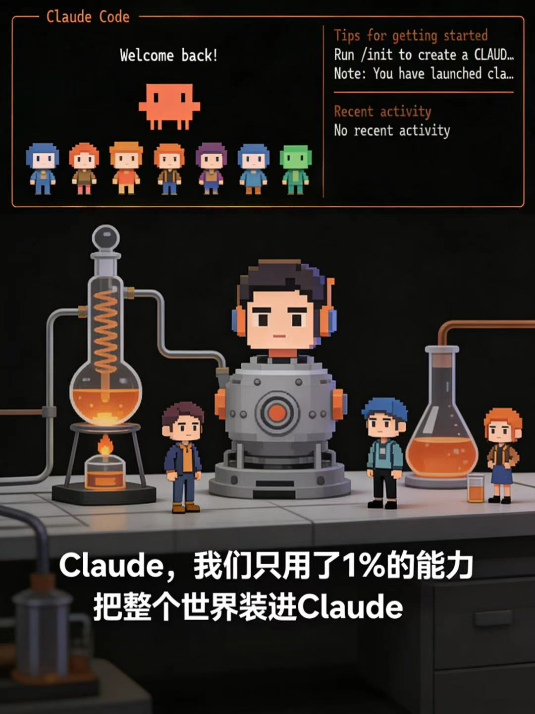

<div align="center">



# 衆生.skill —— 蒸餾天下，百業皆可入技

> *「世間千萬角色，AI爲君存之。」*

[](LICENSE)
[](https://python.org)
[](https://claude.ai/code)
[](https://agentskills.io)

<br>

欲覓人語而左右無人耶？<br>
欲與古賢論道而史書冰冷耶？<br>
欲問專業之事而不識其人耶？<br>
欲得教練/醫師/主考官隨侍在側耶？<br>

**舉天下之人，盡納 Claude。欲見何人，一呼即至。**<br>
**萬物皆可爲師，何人何物，皆可成技。**

[**觀原文**](README.md) · [**英文**](README_EN.md) · [**用法**](#用法) · [**現成角色**](#現成角色)

</div>

---

## 敘

本項目架構，實受啓於二賢：

- **[同事.skill](https://github.com/titanwings/colleague-skill)** by [titanwings](https://github.com/titanwings) —— 首創「蒸餾人爲 AI Skill」之雙層架構
- **[前任.skill](https://github.com/therealXiaomanChu/ex-skill)** by [therealXiaomanChu](https://github.com/therealXiaomanChu) —— 推廣此架構於情誼之間

同事去，有**同事.skill**；前任去，有**前任.skill**；今欲得天下之人，則有**衆生.skill**。

---

## 能做何事

| 角色 | 用法 |
|------|------|
| 👨‍🏫 **師者** | 上傳講義筆記 → 生成此師，隨時爲君講學答問 |
| 🎤 **樂人** | 告之以君所好之歌 → 與君論音樂，薦新歌 |
| 🧠 **醫心者** | 聽君傾訴，爲君梳理情志 |
| 💪 **禦侮之師** | 依君身體，定練身之計，指導動作 |
| 🍳 **庖人** | 依君冰箱所有，教君調味做菜 |
| 👔 **职场導師** | 改君簡歷，模擬面試，解职场之惑 |
| 🧙 **人生導師** | 聽君迷濛，贈以良言 |
| 📖 **說書人** | 授以故事梗概，爲君說完整篇章 |
| 💼 **主考官** | 模擬面試，提問點評 |
| 🎭 **伶人** | 入角色與君對戲 |
| 🔮 **卜者** | ... 君欲開則開 |
| 👥 **羣賢會** | 令數角色共論一题，使孔子與蘇格拉底論道，愛因斯坦與霍金談黑洞 |
| **... 等等** | 凡君所思，皆能生成 |

---

## 安裝

### 方式一：已有 Claude Code

> **重要**：Claude Code 從 **git 倉庫根目錄** 的 `.claude/skills/` 查找 skill，請於正確位置執行。

```bash
# 安裝到當前項目（在 git 倉庫根目錄執行）
mkdir -p .claude/skills
git clone https://github.com/computersniper/roles-skill .claude/skills/create-role

# 或安裝到全局（所有項目皆可用）
git clone https://github.com/computersniper/roles-skill ~/.claude/skills/create-role
```

### 方式二：從頭安裝

**第一步**：安裝 Claude Code

```bash
# 安裝 Claude Code CLI
npm install -g @anthropic-ai/claude-code
```

**第二步**：登錄認證

```bash
claude login
```

**第三步**：克隆本項目到你的 skills 目錄

```bash
# 安裝到當前項目（在 git 倉庫根目錄執行）
mkdir -p .claude/skills
git clone https://github.com/computersniper/roles-skill .claude/skills/create-role

# 或安裝到全局（所有項目皆可用）
mkdir -p ~/.claude/skills
git clone https://github.com/computersniper/roles-skill ~/.claude/skills/create-role
```

**第四步**：安裝完成，打開 Claude Code 對話框，交給他即可。

---

## 用法

於 Claude Code 中輸入：

```
/create-role
```

依提示輸入：
1. **角色名稱**（必填）
2. **基本描述**（一句話：職業、領域、風格，想到什麼寫什麼）
3. **性格標籤**（一句話：MBTI、風格特點）

所有字段皆可跳過，僅憑描述也能生成。

完成後用 `/{slug}` 調用此角色 Skill，開始對話。

### 管理命令

| 命令 | 說明 |
|------|------|
| `/list-roles` | 列所有已創建角色 |
| `/{slug}` | 調用完整 Skill（專業知識 + 角色性格）|
| `/{slug}-knowledge` | 僅出專業知識 |
| `/{slug}-persona` | 僅出性格風格 |
| `/role-rollback {slug} {version}` | 回滾到歷史版本 |
| `/delete-role {slug}` | 刪除角色 |

---

## 羣賢會

可選數已創建角色，令共論話題。**舉天下角色盡納其中，使古人與今人語，令異域大師思想碰撞**。

### 使用方法

```
/group-chat 話題 角色1 角色2 角色3...
```

### 示例場景

| 場景 | 命令示例 |
|------|----------|
| **孔子 vs 蘇格拉底** 論道 | `/group-chat 何謂真正之智 confucius socrates` |
| **李白 vs 杜甫** 談詩 | `/group-chat 作詩最重要者爲何 libai dufu` |

> 💡 **提示**：角色愈多，對話愈精彩！可令三五個甚至更多角色共論。

---

## 現成角色

本倉庫已預置 **七十二** 角色，克隆後直接調用，開箱即用。你也可以用 `/create-role` 繼續創造更多。

### 📖 [觀完整點名冊 → ROLLECALL.md](./ROLLECALL.md)

### 調用方法

克隆本項目後，直接在 Claude Code 中按 slug 調用：
```
/albert_einstein        # 愛因斯坦 - 完整模式（知識 + 性格）
/product_manager         # 產品經理 - 產品問答
/confucius               # 孔子 - 對話論道
```

---

## 項目結構

本項目遵循 [AgentSkills](https://agentskills.io) 開放標準，整個 repo 就是一個 skill：

```
create-role/
├── SKILL.md              # skill 入口（官方 frontmatter）
├── prompts/              # Prompt 模板
│   ├── intake.md         #   對話式信息錄入
│   ├── knowledge_analyzer.md # 專業知識提取
│   ├── persona_analyzer.md  # 性格行爲提取（含標籤翻譯表）
│   ├── knowledge_builder.md # knowledge.md 生成模板
│   ├── persona_builder.md  # persona.md 五層結構模板
│   ├── merger.md          # 增量 merge 邏輯
│   └── correction_handler.md # 對話糾正處理
├── tools/                # Python 工具
│   ├── skill_writer.py   # Skill 文件管理
│   └── version_manager.py # 版本存檔與回滾
├── roles/                # 生成的角色 Skill（gitignored）
├── docs/PRD.md
├── requirements.txt
└── LICENSE
```

---

## 註

- **原材料質量決定還原度**：講義筆記 > 僅手動描述
- 建議優先提供：此角色**解何事**、**常用何法**、**說話有何特點**
- 本項目僅依君描述生成 AI 角色，不代表真實人物觀點

---

## 歡迎貢獻

吾等目標：**舉古今中外未來所有角色，盡納此倉庫**。今已有七十二，猶繼續增之！

歡迎各種形式之貢獻：
- **👤 貢獻角色**：若君以爲某角色當在於此，歡迎 PR 添加
- **💻 貢獻代碼**：改進工具，修復 bug，添加功能
- **💡 貢獻想法**：君欲得何新功能？歡迎開 issue 討論
- **👥 邀好友**：約兄弟好友一起創造角色！

---

<div align="center">

MIT License © [computersniper](https://github.com/computersniper)

</div>
