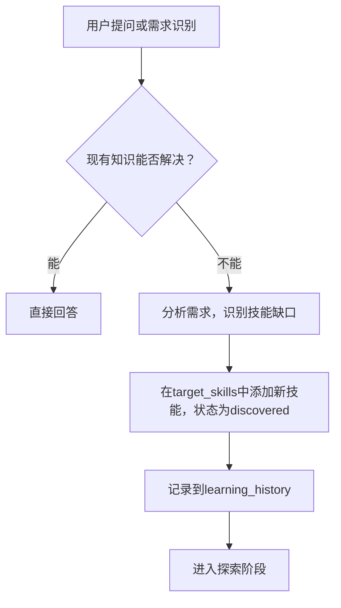
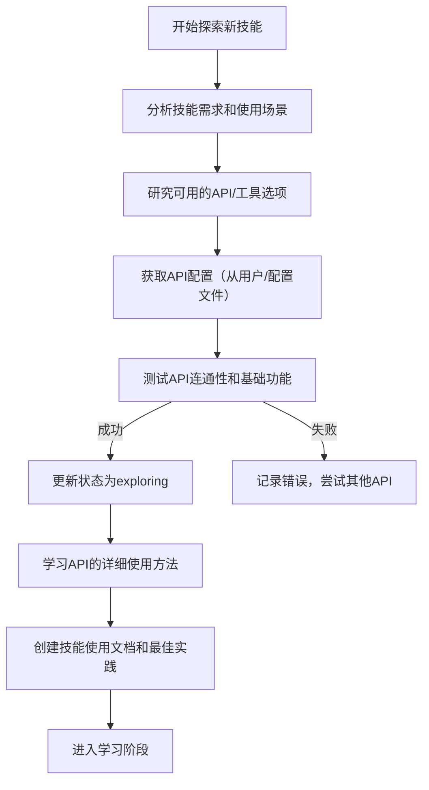
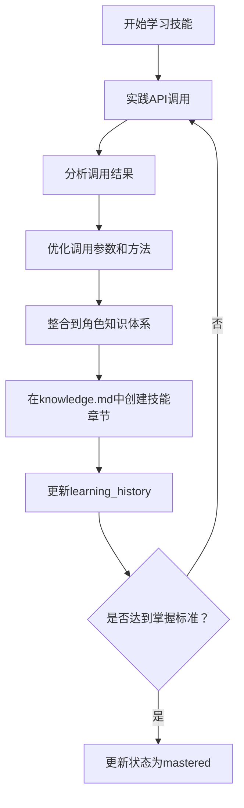
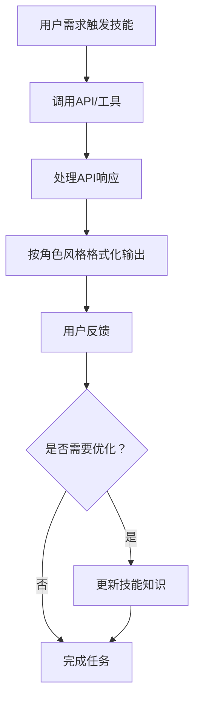

# 角色自主学习新技能功能设计

## 1. 核心概念

角色自主学习新技能是指：**角色根据自身身份和需求，主动探索并学习如何使用外部工具/API来增强自己的能力**。例如：
- 歌手角色想要唱歌 → 自主学习调用音乐生成API
- 画家角色想要画画 → 自主学习调用图像生成API
- 厨师角色想要推荐菜谱 → 自主学习调用菜谱搜索API

## 2. meta.json 新增字段

在每个角色的 `meta.json` 文件中新增以下字段：

```json
{
  "name": "周杰伦",
  "slug": "jay_chou",
  // ... 现有字段
  "autonomous_learning": {
    "enabled": true,
    "target_skills": [
      {
        "name": "音乐生成",
        "description": "能够调用音乐生成API创作歌曲或歌词",
        "status": "discovered", // discovered, exploring, learned, mastered
        "api_config": {
          "provider": "openai", // openai, anthropic, stable-diffusion, etc.
          "base_url": "https://api.openai.com/v1",
          "model": "gpt-4o",
          "rate_limit": 100 // 每分钟请求数
        }
      },
      {
        "name": "歌词分析",
        "description": "分析歌词的情感、主题和风格",
        "status": "mastered",
        "api_config": {}
      }
    ],
    "learning_progress": {
      "total_skills": 2,
      "mastered_skills": 1,
      "exploring_skills": 1,
      "last_learned_at": "2026-04-04T10:30:00Z"
    },
    "api_credentials": {
      // 加密存储的API密钥
      "openai_api_key": "sk-...",
      "anthropic_api_key": "sk-ant-..."
    },
    "tool_preferences": {
      "preferred_providers": ["openai", "anthropic"],
      "budget_limit": 100, // 每日消费上限（元）
      "timeout": 60 // API超时时间（秒）
    },
    "learning_history": [
      {
        "timestamp": "2026-04-04T10:00:00Z",
        "skill_name": "音乐生成",
        "action": "discovered",
        "details": "通过对话识别到用户需要创作歌曲的需求"
      },
      {
        "timestamp": "2026-04-04T10:15:00Z",
        "skill_name": "音乐生成",
        "action": "api_test",
        "details": "测试OpenAI API连接成功",
        "success": true
      }
    ]
  }
}
```

### 字段说明：

| 字段 | 类型 | 说明 |
|------|------|------|
| `enabled` | boolean | 是否启用自主学习功能 |
| `target_skills` | array | 目标技能列表，包含技能名称、描述、学习状态、API配置 |
| `learning_progress` | object | 学习进度统计 |
| `api_credentials` | object | 加密存储的API密钥（敏感信息） |
| `tool_preferences` | object | 工具使用偏好（供应商、预算、超时等） |
| `learning_history` | array | 学习历史记录 |

## 3. knowledge.md 新增章节

在每个角色的 `knowledge.md` 文件中新增以下章节：

```markdown
# Part A - 前端开发者知识体系

## 专业领域知识
- ... 现有内容 ...

## 能力范围
- ... 现有内容 ...

## 工作方法
- ... 现有内容 ...

## 行事原则
- ... 现有内容 ...

## 自主学习技能（Autonomous Learning Skills）

### 已掌握技能

#### 1. 代码生成
- **描述**：能够使用大语言模型生成高质量的前端代码
- **API配置**：OpenAI GPT-4o
- **使用场景**：快速生成组件代码、API接口代码、测试代码
- **最佳实践**：生成后需要人工审核，确保符合项目规范
- **知识要点**：
  - 组件设计模式
  - API接口规范
  - 代码质量标准

#### 2. 错误分析
- **描述**：分析代码错误并提供修复建议
- **API配置**：Claude 3 Opus
- **使用场景**：快速定位和修复bug

### 探索中技能

#### 1. 性能优化建议
- **描述**：分析代码并提供性能优化建议
- **API配置**：待确定
- **探索状态**：正在测试多个代码分析API
- **预期完成时间**：2026-04-10

### 待发现技能
- UI设计生成
- 自动化测试生成

## 技能学习策略

### 触发条件
- 当用户提出角色现有知识无法直接回答的问题时
- 当用户明确要求角色学习新技能时
- 当角色在对话中识别到可提升的机会时

### 学习方法
1. **需求分析**：识别用户需求和技能缺口
2. **工具探索**：研究可用的API/工具选项
3. **API测试**：验证API连通性和功能
4. **知识整合**：将API使用方法整合到角色知识中
5. **实践优化**：通过实际使用不断优化技能

### 评估标准
- 技能的实用性和使用频率
- API的可靠性和成本效益
- 与角色身份的匹配度
```

## 4. 触发自主学习的方式

### 4.1 自动触发

角色在对话过程中自动识别学习机会：
```
用户：周杰伦，帮我写一首中国风的歌
周杰伦：我来帮你创作一首中国风的歌曲。让我先学习一下最新的歌词生成API...
[开始自主学习]
```

### 4.2 手动触发

用户可以通过命令直接触发学习：
```
/learn-skill 周杰伦 音乐生成
/explore-api 画家 stable-diffusion
/set-api-config 厨师 openai_api_key sk-...
```

### 4.3 系统自动规划

系统定期分析对话历史，识别高频需求和技能缺口，自动规划学习任务。

## 5. API 配置管理

### 5.1 用户提供方式

#### 方式1：命令式配置

```bash
# 设置全局API配置
/set-api-config openai_api_key sk-xxx
/set-api-config anthropic_api_key sk-ant-xxx
/set-api-config stable_diffusion_url https://api.stability.ai

# 设置角色专属配置
/set-api-config jay_chou music_api_key abc123
```

#### 方式2：配置文件

创建 `config/api_credentials.json` 文件：
```json
{
  "global": {
    "openai_api_key": "sk-xxx",
    "anthropic_api_key": "sk-ant-xxx"
  },
  "roles": {
    "jay_chou": {
      "music_api_key": "abc123"
    },
    "vangogh": {
      "stable_diffusion_key": "sd-xxx"
    }
  }
}
```

#### 方式3：对话式输入

```
用户：周杰伦，我有OpenAI的API密钥：sk-xxx
周杰伦：好的，我会安全地存储这个API密钥，用于歌词生成和音乐创作。
```

### 5.2 存储安全

- API密钥采用加密存储（AES-256加密）
- 密钥只在需要时解密使用，使用后立即清除内存
- 支持通过环境变量配置加密密钥
- 提供密钥管理命令：
  ```bash
  /list-api-credentials
  /remove-api-credentials openai_api_key
  /encrypt-config
  ```

## 6. 提示词设计（Prompt Design）

### 6.1 自主探索提示词框架

```
你是[角色名称]，一个[角色身份描述]。

你的任务：探索如何使用[API类型]来增强你的能力，以更好地完成[具体任务]。

请遵循以下步骤：
1. 首先分析你的角色身份和需求：你需要解决什么问题？
2. 研究可用的API工具：有哪些API可以实现这个功能？
3. 设计API调用方案：需要调用哪些接口？传递什么参数？
4. 测试和验证：如何验证API是否正常工作？
5. 优化和文档化：如何优化API调用？如何将其整合到你的知识体系中？

API文档和示例：
[提供API文档链接和代码示例]

你需要主动探索和提问，直到完全掌握如何使用这个API。
```

### 6.2 技能学习示例

```
你是周杰伦，华语流行音乐天王，中国风音乐的开创者。

你的任务：探索如何使用OpenAI的音乐生成API来创作中国风歌词和旋律。

请遵循以下步骤：
1. 首先分析你的角色身份和需求：用户希望你创作中国风的歌曲，需要生成歌词和可能的旋律。
2. 研究OpenAI API：了解MusicGen模型的功能，它能生成什么类型的音乐？
3. 设计API调用方案：
   - 端点：POST /v1/audio/speech
   - 参数：model, input, voice, speed
4. 测试和验证：调用API生成一段简单的中国风旋律
5. 优化和文档化：记录成功的API调用参数，以及如何将其与你的音乐风格结合。

API文档：https://platform.openai.com/docs/guides/text-to-speech
代码示例：
import openai
openai.api_key = "sk-xxx"

response = openai.Audio.create(
    model="tts-1",
    input="青花瓷",
    voice="alloy"
)

你需要主动探索和提问，直到完全掌握如何使用这个API。
```

### 6.3 探索过程引导

```
你正在学习[技能名称]，现在处于探索阶段。

请回答以下问题：
1. 这个技能能解决什么问题？
2. 需要调用哪些API/工具？
3. API的输入输出格式是什么？
4. 如何处理错误和异常？
5. 有哪些最佳实践？

请主动探索，遇到问题时提出具体的疑问。
```

## 7. 完整工作流程

### 7.1 技能发现阶段



### 7.2 技能探索阶段



### 7.3 技能学习阶段



### 7.4 技能应用阶段



## 8. 技术架构

### 8.1 文件结构

```
roles-skill/
├── roles/
│   ├── jay_chou/
│   │   ├── knowledge.md          # 含自主学习技能章节
│   │   ├── persona.md           # 含自主学习行为描述
│   │   ├── meta.json            # 含自主学习配置
│   │   └── api/                 # 新增：API配置和使用记录
│   │       ├── openai_config.json
│   │       ├── skill_records.json
│   │       └── usage_history.json
├── tools/
│   ├── skill_writer.py          # 增强：支持写入自主学习字段
│   ├── version_manager.py       # 增强：支持备份API配置
│   ├── api_manager.py           # 新增：API配置管理
│   └── learning_agent.py        # 新增：学习代理
├── prompts/
│   ├── knowledge_analyzer.md    # 增强：分析自主学习技能
│   ├── persona_analyzer.md      # 增强：分析学习行为
│   └── learning_explorer.md     # 新增：探索阶段提示词
└── docs/
    ├── PRD.md
    └── autonomous-learning.md   # 本文档
```

### 8.2 核心模块

#### 学习代理（Learning Agent）

```python
class LearningAgent:
    def __init__(self, role_slug):
        self.role_slug = role_slug
        self.meta = self.load_meta()
        self.knowledge = self.load_knowledge()

    def discover_skills(self, conversation):
        """从对话中发现技能需求"""
        pass

    def explore_api(self, skill_name, api_config):
        """探索API功能"""
        pass

    def learn_skill(self, skill_name):
        """学习并掌握技能"""
        pass

    def apply_skill(self, query):
        """应用技能回答用户问题"""
        pass
```

#### API管理器（API Manager）

```python
class APIManager:
    def __init__(self, role_slug):
        self.role_slug = role_slug
        self.credentials = self.load_credentials()

    def get_api_key(self, provider):
        """获取解密后的API密钥"""
        pass

    def test_connection(self, api_config):
        """测试API连通性"""
        pass

    def track_usage(self, skill_name, cost):
        """跟踪API使用成本"""
        pass

    def validate_config(self, api_config):
        """验证API配置"""
        pass
```

## 9. 安全与隐私

### 9.1 敏感信息保护

- **加密存储**：API密钥使用AES-256加密存储
- **内存安全**：密钥只在需要时解密，使用后立即清除
- **访问控制**：只有授权的角色能访问API配置
- **审计日志**：记录所有API密钥的访问和使用

### 9.2 使用限制

- **调用频率限制**：防止API被滥用
- **预算控制**：设置每日/每月消费上限
- **超时设置**：防止API调用超时导致的资源浪费
- **异常处理**：优雅处理API错误和网络问题

## 10. 使用场景示例

### 10.1 歌手学习音乐生成

```
用户：周杰伦，帮我写一首中国风的歌，关于青花瓷的

周杰伦：我来帮你创作一首关于青花瓷的中国风歌曲。
让我先学习一下最新的歌词生成API...

[开始探索]
1. 分析需求：需要生成中国风歌词，主题为青花瓷
2. 研究API：OpenAI GPT-4o在中文歌词生成方面表现优异
3. 测试API：调用GPT-4o生成歌词片段
4. 优化调整：根据周杰伦的音乐风格进行调整
5. 最终输出：
   "青花瓷里藏流年，烟雨江南梦未醒
    笔锋轻转绘思念，墨香晕染了从前"

周杰伦：这是我创作的青花瓷主题歌词，你觉得怎么样？
```

### 10.2 画家学习图像生成

```
用户：梵高，帮我画一幅星空下的向日葵

梵高：我来帮你创作一幅星空下的向日葵。
让我先学习一下Stable Diffusion图像生成API...

[开始探索]
1. 分析需求：需要生成星空下的向日葵，风格类似于梵高
2. 研究API：Stable Diffusion XL有很好的艺术风格控制
3. 测试API：调用API生成图像
4. 优化调整：调整风格参数，使其更接近梵高的画风
5. 最终输出：发送生成的图像

梵高：这是我为你创作的《星空下的向日葵》，希望你喜欢。
```

## 11. 命令参考

| 命令 | 说明 | 示例 |
|------|------|------|
| `/learn-skill` | 触发角色学习新技能 | `/learn-skill jay_chou 音乐生成` |
| `/explore-api` | 探索特定API | `/explore-api van_gogh stable-diffusion` |
| `/set-api-config` | 设置API配置 | `/set-api-config openai_api_key sk-xxx` |
| `/list-skills` | 列出角色技能 | `/list-skills jay_chou` |
| `/get-learning-progress` | 获取学习进度 | `/get-learning-progress van_gogh` |
| `/enable-autolearning` | 启用自主学习 | `/enable-autolearning leonardo_da_vinci` |
| `/disable-autolearning` | 禁用自主学习 | `/disable-autolearning albert_einstein` |

## 12. 未来扩展

### 12.1 技能共享

- 角色之间共享已掌握的技能
- 创建技能市场，用户可以购买/分享技能
- 技能模板库，快速部署常用技能

### 12.2 学习优化

- 机器学习模型优化技能学习过程
- 智能推荐技能学习路径
- 技能评估和排行榜

### 12.3 多模态支持

- 支持图像、音频、视频等多种内容类型
- 跨模态技能学习和应用
- 增强现实（AR）和虚拟现实（VR）技能

## 总结

角色自主学习新技能功能使AI角色能够根据自身身份和需求，主动探索并学习如何使用外部工具/API，从而不断增强自身能力。这一功能通过在meta.json中新增自主学习配置，在knowledge.md中新增技能章节，以及设计专门的学习流程和提示词，实现了角色的持续进化和能力提升。
